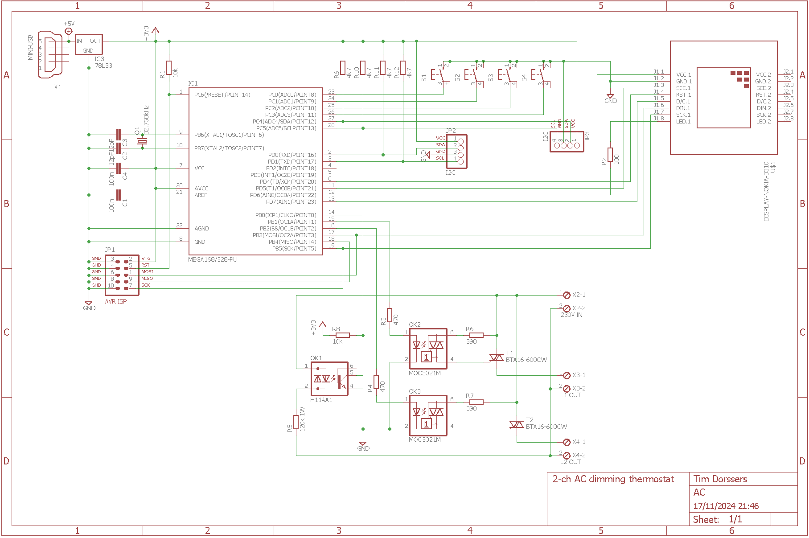
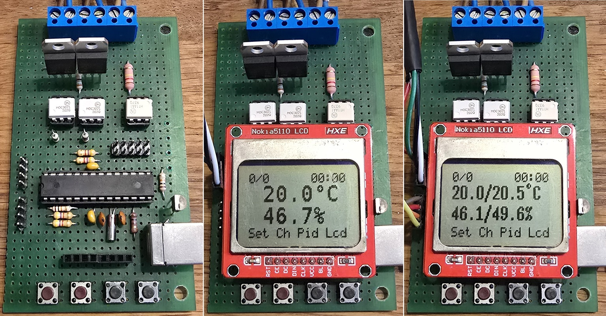

# Thermostat

2 Channel AC Dimming Thermostat and Timer

## Overview

This is a graphical menu configurable AC dimming thermostat with two output channels. Each channel be set to on/off switching. Up to two temperature sensors are detected automatically. Each channel is controlled individually when using two sensors. Start of daytime and length of day are used to determine day and night temperatures.

The dimming hardware uses zero-cross detection which gives a positive edge at the end of a half sine wave and a negative edge at the start of a half sine wave on the ICP1 pin. The OC1x pins connect to photo-TRIACs that drive the power TRIACs to control the leading edge.

## Hardware

* ATmega328P @ 8 MHz
* PCD8544 LCD controller
* AHT15/AHT20/AHT21/AHT25 or AM2320 temperature and humidity sensor

## Schematic

## Prototype

## Firmware
The firmware has been developed in Atmel Studio 7 using GCC C and can be uploaded to the ATmega32 using the ISP connector and an ISP programmer such as [USBasp tool](http://www.fischl.de/usbasp/) using [avrdude](http://www.nongnu.org/avrdude/):

`avrdude -p m328p -c usbasp -U flash:w:ACDimmer.hex:i -U lfuse:w:0xe2:m -U hfuse:w:0xd9:m`
